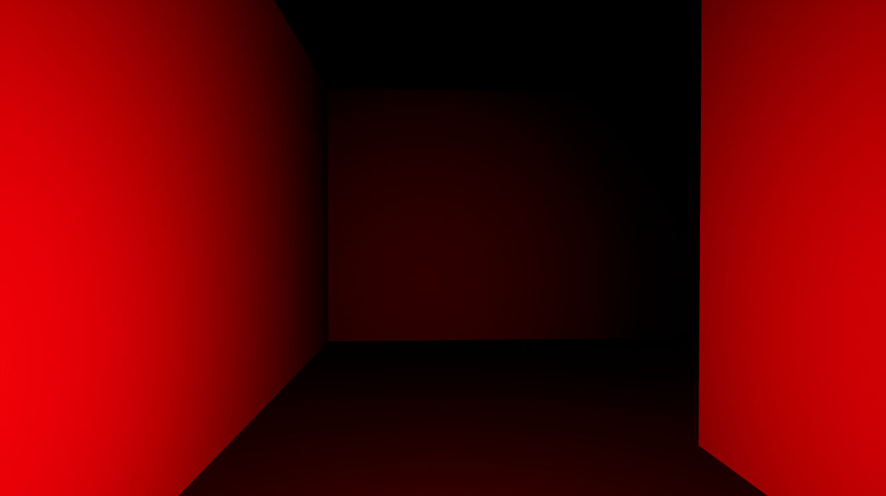
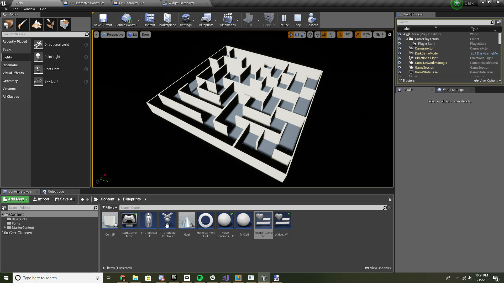

# Dark
Dark is procedurally-generated horror escape game developed in Unreal Engine 4 and C++.

## Random Mazes
The primary purpose of this project is demonstrate random maze generation in UE4 and C++. The algorithm used is based on backtracking and depth-first traversal.

## Goal
The goal of this game is reach the cone of light and escape darkness before the darkness consumes you.